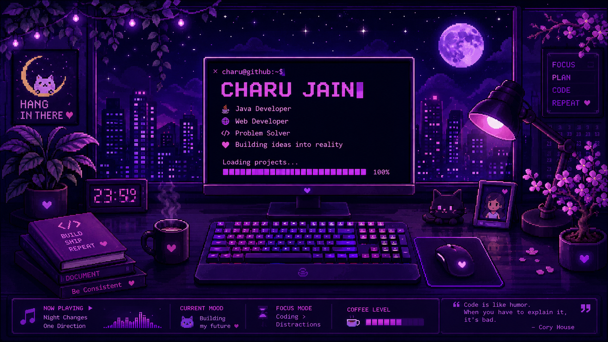

<h1 align="center">
Hi 👋 I'm Charu Jain
</h1>

<h3 align="center">
Java Developer • Web Developer •Hustler
</h3>

## 👩‍💻 About Me

🎓 B.Tech Student

☕ Learning Java & DSA

🌐 Web Development

🤖 Machine Learning

🎨 Graphic Designing

🚀 Open Source Enthusiast
## 🛠 Tech Stack

